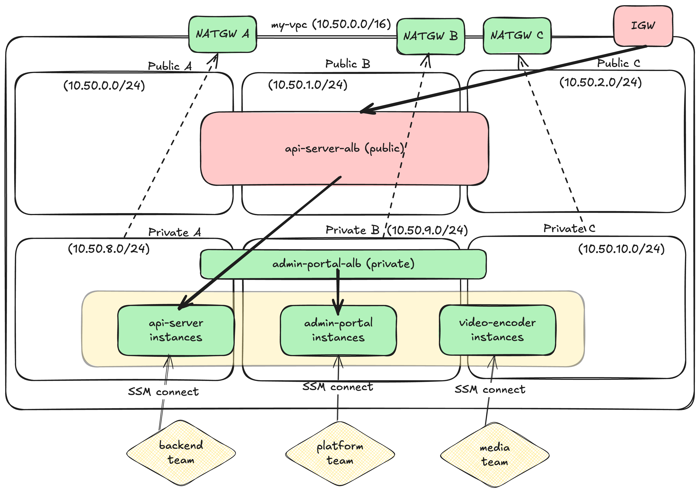

# AWS Infrastructure as Code

Terraform을 사용한 3-tier 웹 애플리케이션 인프라 구성 프로젝트입니다.

## 요구사항

### 기본 인프라 구성
- VPC 생성 (Default Cidr: `10.50.0.0/16`)
- VPC 내 Public Subnets (AZ당 1개씩 총 3개)
- VPC 내 Private Subnets (AZ당 1개씩 총 3개)
- Internet Gateway, NAT Gateway
- Traffic routing 을 위한 Route table 구성


**코드 위치**:
- [phase_1_network/main.tf](phase_1_network/main.tf#L8-L32) - VPC 모듈 호출
- [phase_1_network/outputs.tf](phase_1_network/outputs.tf) - VPC ID, Subnet IDs 출력

### EC2 인스턴스 생성 (C type, M type, T type)
- **t3.large** (Burstable) - 내부 관리 도구용
- **m7i-flex.large** (Memory Optimized) - 메모리 집약적 작업용
- **c7i.large** (Compute Optimized) - CPU 집약적 작업용

**코드 위치**:
- [phase_3_computing/server_info/admin-portal.yaml](phase_3_computing/server_info/admin-portal.yaml#L2) - t3a.medium
- [phase_3_computing/server_info/api-server.yaml](phase_3_computing/server_info/api-server.yaml#L2) - m7i-flex.large
- [phase_3_computing/server_info/video-encoder.yaml](phase_3_computing/server_info/video-encoder.yaml#L2) - c7i.large
- [phase_3_computing/modules/ec2/main.tf](phase_3_computing/modules/ec2/main.tf#L9-L107) - EC2 모듈 (2단계 for_each)

### 인스턴스당 별도 팀 태그 할당
- YAML 내 `team` key-value로 전달받아 instance tag로 삽입
- 태그 기반 SSM 접근 제어

**코드 위치**:
- [phase_3_computing/server_info/*.yaml](phase_3_computing/server_info/) - `team` 필드 정의
- [phase_3_computing/modules/ec2/main.tf](phase_3_computing/modules/ec2/main.tf#L99-L106) - Team 태그 병합
- [phase_2_iam/main.tf](phase_2_iam/main.tf#L34-L48) - Team 태그 기반 SSM 접근 제어 정책

### 재사용성 가능한 방식으로 적용
- **확장성을 고려한 설계**
  - 공통적으로 구성되는 내용은 코드 내 모듈로 구성
    - EC2 모듈
    - ALB 모듈
  - 공통적으로 사용되는 tags는 local 상단부에 선언 후 기본적으로 merge하여 사용

- **Terraform AWS 공식 모듈 활용**
  - [terraform-aws-modules](https://registry.terraform.io/namespaces/terraform-aws-modules) 사용
  - **선택 이유**:
    1. **완전한 옵션 지원**: AWS 리소스의 모든 파라미터를 변수로 받을 수 있음
    2. **버전 고정 가능**: 안정적인 버전 관리로 예측 가능한 인프라 운영
    3. **구조적 효율성**: 검증된 모듈 구조로 유지보수 비용 절감
  - **커스터마이징**: 프로젝트 특수 요구사항은 커스텀 모듈로 래핑하여 사용
    - 예시: `modules/ec2/` - 공식 EC2 모듈 위에 2단계 for_each 로직 추가
    - 예시: `modules/alb/` - 공식 ALB 모듈 위에 YAML 기반 설정 로직 추가

**코드 위치**:
- [phase_1_network/main.tf](phase_1_network/main.tf#L8-L32) - VPC 공식 모듈 사용
- [phase_3_computing/modules/ec2/](phase_3_computing/modules/ec2/) - EC2 재사용 모듈 (커스텀 래핑)
- [phase_3_computing/modules/alb/](phase_3_computing/modules/alb/) - ALB 재사용 모듈 (커스텀 래핑)
- [phase_3_computing/modules/ec2/main.tf](phase_3_computing/modules/ec2/main.tf#L1-L6) - 공통 tags (locals)
- [phase_3_computing/modules/ec2/main.tf](phase_3_computing/modules/ec2/main.tf#L99) - tags merge 사용

### 기본값으로 적용 사항 (하드코딩)
- **EBS 암호화**: `encrypted = true` (규정 준수)
- **EBS 기본 볼륨 타입 gp3**: 비용 최적화 (gp2 대비 20% 저렴)
- **T 시리즈 Credit 제한 설정**: `cpu_credits = "standard"` (비용 통제)

**코드 위치**:
- [phase_3_computing/modules/ec2/main.tf](phase_3_computing/modules/ec2/main.tf#L53-L60) - Root block device (암호화, gp3)
- [phase_3_computing/modules/ec2/main.tf](phase_3_computing/modules/ec2/main.tf#L65-L77) - Additional EBS volumes (암호화, gp3)
- [phase_3_computing/modules/ec2/main.tf](phase_3_computing/modules/ec2/main.tf#L86) - T 시리즈 CPU Credits

### SG 및 IAM Role 하드코딩으로 적용
**설계 의도**: 보안과 비용에 직접적인 영향을 미치는 설정은 변수로 노출하지 않고 코드에 직접 고정하여 변경을 원천 차단

1. **Security Group (SG)**
   - Egress: 모든 아웃바운드만 허용
   - 변경 불가 이유: 의도치 않은 인바운드 규칙 추가 방지

2. **IAM Role**
   - SSM(Session Manager) 정책만 부여
   - 변경 불가 이유: 과도한 권한 부여 방지, SSH 키 관리 불필요

**코드 위치**:
- [phase_3_computing/modules/ec2/security_group.tf](phase_3_computing/modules/ec2/security_group.tf) - Security Group (Egress only)
- [phase_3_computing/modules/ec2/iam.tf](phase_3_computing/modules/ec2/iam.tf) - IAM Instance Profile (SSM 정책)
- [phase_2_iam/main.tf](phase_2_iam/main.tf#L79-L102) - 팀별 IAM Role

### **Optional: 그 외 추가 구성**

- **VPC Endpoints (SSM 접속용)**
  - `com.amazonaws.ap-northeast-2.ssm`
  - `com.amazonaws.ap-northeast-2.ec2messages`
  - `com.amazonaws.ap-northeast-2.ssmmessages`
  - Private Subnet의 EC2 인스턴스가 인터넷 게이트웨이 없이 SSM 접속 가능

  **코드 위치**: [phase_1_network/vpc_endpoints.tf](phase_1_network/vpc_endpoints.tf)

- **ELB (Application Load Balancer)**
  - **admin-portal ALB** (Internal) - 1개
  - **api-server ALB** (Internet-facing) - 1개
  - Health check: `/health` 엔드포인트

  **코드 위치**:
  - [phase_3_computing/modules/alb/main.tf](phase_3_computing/modules/alb/main.tf#L11-L114) - ALB 모듈
  - [phase_3_computing/server_info/admin-portal.yaml](phase_3_computing/server_info/admin-portal.yaml#L8-L13) - admin-portal ALB 설정 (internal)
  - [phase_3_computing/server_info/api-server.yaml](phase_3_computing/server_info/api-server.yaml#L8-L14) - api-server ALB 설정 (internet-facing)

- **관리용 IAM (Team 기반 접근 제어)**
  - 팀별 IAM Role 생성 (platform, backend, media)
  - ReadOnlyAccess + SSM Session Manager 권한 부여
  - **Team 태그 기반 접근 제어**: 각 팀은 자신의 Team 태그가 있는 인스턴스에만 VPC Endpoint를 통해 SSM 접속 가능
  - 예시:
    - `platform-team-role` → `Team=platform` 인스턴스만 접속
    - `backend-team-role` → `Team=backend` 인스턴스만 접속
    - `media-team-role` → `Team=media` 인스턴스만 접속

  **코드 위치**:
  - [phase_2_iam/main.tf](phase_2_iam/main.tf#L17-L75) - Team 태그 기반 IAM Policy
  - [phase_2_iam/main.tf](phase_2_iam/main.tf#L114-L119) - ReadOnlyAccess 권한 부여

- **EC2 User Data (Nginx 자동 설치 및 구성)**
  - Cloud-init 스크립트로 Nginx 자동 설치 및 시작
  - `/health` 엔드포인트 구성으로 ALB Health Check 지원
  - 서비스명을 동적으로 포함한 Health Check 응답 (예: `Service: api-server`)
  - **보안 강화**: ALB 트래픽만 수신 가능하도록 Security Group 설정
    - EC2 Security Group: 기본적으로 Egress만 허용
    - ALB→EC2 Ingress 규칙: ALB Security Group을 소스로 하는 규칙만 추가
    - ALB가 있는 서비스만 포트 80 인바운드 허용 (admin-portal, api-server)

  **코드 위치**:
  - [phase_3_computing/modules/ec2/files/user_data.tftpl](phase_3_computing/modules/ec2/files/user_data.tftpl) - Cloud-init 스크립트 (Nginx 설치 및 구성)
  - [phase_3_computing/modules/ec2/security_group.tf](phase_3_computing/modules/ec2/security_group.tf#L10-L29) - EC2 Security Group (Egress only)
  - [phase_3_computing/main.tf](phase_3_computing/main.tf#L77-L87) - ALB→EC2 Ingress 규칙 (ALB SG만 허용)

## 프로젝트 개요

이 프로젝트는 AWS에서 안전하고 확장 가능한 인프라를 코드로 관리하기 위해 설계되었습니다. 보안 정책과 비용 최적화는 강제하되, 인프라 스펙은 유연하게 조정할 수 있도록 구성했습니다.

## 아키텍처




## Phase 구조

```
.
├── phase_1_network/       # VPC, Subnets, NAT, VPC Endpoints
├── phase_2_iam/           # 팀별 IAM Role (SSM 접근 제어)
└── phase_3_computing/     # EC2, ALB, Security Groups
    ├── server_info/       # YAML 기반 서버 설정
    │   ├── admin-portal.yaml
    │   ├── video-encoder.yaml
    │   └── api-server.yaml
    └── modules/
        ├── ec2/           # EC2 모듈 (2단계 for_each)
        └── alb/           # ALB 모듈
```

## 설계 철학

### 핵심 원칙: "보안과 비용은 강제하고, 인프라 스펙은 유연하게"

**하드코딩된 정책** (변경 불가):
1. **EBS 암호화**: `encrypted = true` (규정 준수)
2. **EBS 볼륨 타입**: `type = "gp3"` (비용 최적화)
3. **T 시리즈 Credits**: `cpu_credits = "standard"` (비용 통제)
4. **Security Group**: Egress only (최소 권한)
5. **IAM Role**: SSM 정책만 부여 (SSH 키 불필요)

**YAML로 커스터마이징 가능**:
- 인스턴스 타입, 개수, 볼륨 크기
- IOPS/Throughput, 모니터링 옵션
- 팀 태그, 인스턴스 태그

**이유**: 변수로 노출하면 실수로 정책을 위반할 수 있음. 정책은 코드에 고정하고 YAML에서는 변경 불가능하도록 설계.

### 재사용성 및 확장성
- Terraform 공식 모듈 사용 (aws-modules)
- 2단계 for_each 구조 (서비스별 → 인스턴스 개수별)
- YAML 기반 선언적 관리 (HPA 개념 차용)
- Phase별 State 분리 (Network, IAM, Computing)

## 빠른 시작

### 사전 요구사항
- Terraform ~> 1.13.5 (2025.11.10 latest)
- AWS CLI 설정 완료
- **AWS Profile 설정 (중요)**:
  - 본인이 사용 중인 AWS Account의 Profile을 명시해야 원활한 테스트가 가능합니다
  - 기본값: `playground-admin`
  - 변경 방법:
    - 각 Phase의 `variables.tf`에서 `profile` 변수 수정
    - 또는 Makefile 실행 시 `PROFILE=your-profile` 파라미터 전달

### 1. 배포 방법

**방법 1: Root Makefile 사용 (권장)**

프로젝트 최상단에서 한 번에 모든 Phase를 설치할 수 있습니다.

```bash
# 모든 Phase 한 번에 설치
make install_all ENV=dev PROFILE=playground-admin

# 또는 개별 Phase 설치
make install_phase_1 ENV=dev PROFILE=playground-admin
make install_phase_2 ENV=dev PROFILE=playground-admin
make install_phase_3 ENV=dev PROFILE=playground-admin

# 정리 (역순)
make cleanup_all ENV=dev PROFILE=playground-admin

# 사용 가능한 명령어 확인
make help
```

**방법 2: 각 Phase별 개별 실행**

```bash
# Phase 1: Network
cd phase_1_network
ENV=dev PROFILE=playground-admin make init
ENV=dev PROFILE=playground-admin make apply

# Phase 2: IAM
cd ../phase_2_iam
ENV=dev PROFILE=playground-admin make init
ENV=dev PROFILE=playground-admin make apply

# Phase 3: Computing
cd ../phase_3_computing
ENV=dev PROFILE=playground-admin make init
ENV=dev PROFILE=playground-admin make apply
```

### 2. 테스트

**SSM Session Manager 접속 (Team 태그 기반 접근 제어)**
```bash
# Switch Role URL 확인
cd phase_2_iam && terraform output assume_role_commands

# URL 접속 → Role Switch → EC2 콘솔에서 SSM Connect
# backend-team-role은 Team=backend 인스턴스만 접속 가능
```

**ALB Health Check** (api-server.yaml의 allow_cidrs에 본인 IP 추가 필수)
```bash
curl http://$(cd phase_3_computing && terraform output -raw alb_dns_name)/health
# 응답: Service: api-server
```

